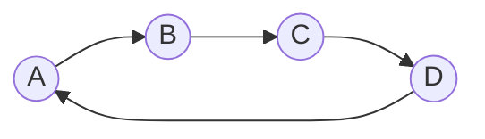

# Graph Theory

By 王骏瑞.

## Content

<center> Pre-Knowledge </center>

1. Vertexes and Edges
2. The Basic Properties of Graph


<center> Graph </center>

1. The Basic Conception of Graph and Edge
2. Tree

<center> More About Graph
</center>

1. The Diameter and The Center of Gravity of the Tree
2. The Shortest Path
3. Maximum / Minimum Spanning Tree (MST)
4. Network Flow

## Pre-Knowledge

### Vertexes And Edges

Definition: 

​	Vertices can be understood as points, descript in a finite set as $V$, 

and Edges can be understood as lines connecting two vertices ($(u, v) \and  u,v \in V \and u \ne v$) , descript in set as $E$.

### The Basic Properties Of Graph

Definition:

​	A Graph is a pair G = (V, E), also understood as "a set of vertices V and a collection of edges E that connects a pair of vertices".

Which means, it contains several vertices and several edges connecting the vertices.

Here's what it looks like:



Symbols:	(What do they meant in this file)

$|V|$ : The number of vertices.

$|E|$ : The number of edges.

Classes:

Tree: A kind of graph that only have $n$ vertices and $n - 1$ edges. (Note: A kind of connected graph.)

Complete graph: A graph have (nearly) each and every pair of vertices connect together by an edge ($n$ vertices and $\frac{n(n - 1)}{2}$ edges).

Dense graph: A graph which $|E|$ is very close to $|V| ^ 2$. 

Sparse graph: A graph which $|E|$ is far less than $|V| ^ 2$.

## Graph

### The Basic Conception of Graph and Edge

​	First start with edges:

​	An edge includes a pair of vertices: $u, v \in V$, if it also have a element called Weight , write as: $w$, then it's called "Weighted Edge".

​	A graph , $G = (V, E)$ , is called "Weighted Graph" if the edges in it have the weight $w$. Just like what I showed below:

```Mermaid
graph LR
	A((A))
	B((B))
	C((C))
	A -- 2 --> B
	B -- 3 --> C
	C -- 4 --> A
```


